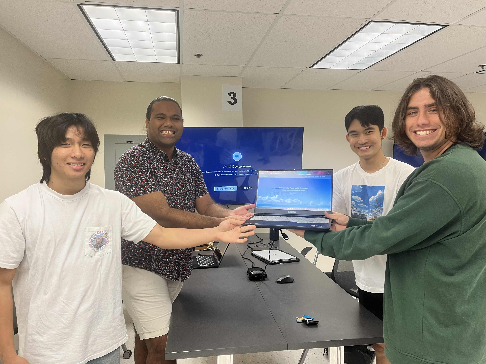

<h2>Issue Driven Project Management</h2>

During the fall of 2023, I took a class about software engineering or ICS 314. Through the course I did learn about the creation of web applications but it was much more than just software development. There were many topics that were discussed in the class such as open source software development, configuration management, functional programming, development environments, and much more. One of the class topics that I found interesting was a style of agile project management called issue driven project management. I am someone who deals with having a hard time with task management, organizing projects, and finishing projects. I believe that issue driven project management has been very helpful with not just my final project for the course but as well as all my projects that I work on moving forward.

<h2>Meet twice a week to manage project</h2>

The first IDPM or issue driven project management guideline is to meet twice a week to manage a project. When working on a team project, I feel that having meetups can be very helpful for productivity and progress. When I know that I have a team meetup soon, I get all I need to do for my tasks so that if I run into any issues I can talk about it to my team. The same goes for my teammates if they run into an issue. It's always a nice bonding experience because you feel like there's not a lot of time to talk during class so it's easier to build relationships with people.

Group photo my with team

Order of individuals from left to right: Jakapop Khongnawang, Taitusi Camanilotu, Chad Maeshiro, and Liam (Kula) Van Asperen

<h2>Divide work into 72 hour tasks</h2>

When starting to work on your team's project there are some tasks that are just difficult and lengthy to complete. 72 hour taks makes task management more breathable as you cannot list the task if you can’t finish it in 72 hours. If it's too big then you have to break it down into even smaller, more manageable chunks. For my team, we made sure to have each other's backs and to always ask if the task is too big. If the issue is too big there is no shame in breaking it down into smaller chunks.

<h2>Document each task as a GitHub issue</h2>

Having a clear, set, and documented task is very helpful when starting a work session. As you may get lost just trying to figure out what you're supposed to be doing on your own. Having well documented tasks is helpful so you don’t get off track. The tasks should be detailed and provide more than enough information for you or other team members to understand and complete that task.

<h2>Perform work associated with each task in its own branch and Name branches “issue-XX”, where “XX” is the issue number</h2>

Throughout the course, I learned a lot about the importance of github and how versatile it is. You can save your entire project on the site, create github projects which you can then create issues and organize tasks. For every issue/task, you can create a specific branch for each. Initially when working on our team's project we had specific branches for each of our teammates. Each branch would be named braddah then your first name. For example my branch was braddahLiam, but creating branches and managing issues like this made some things difficult. So our professor talked to us about the IDPM guidelines and said that we should create our branches based on our issue number. Originally our team really liked the “braddah branches”, but finishing tasks associated with its own branch proved more effective.

<h2>Conclusion</h2>

In conclusion, I found issue driven project management very effective for not only my team but myself as well. I feel that having these guidelines in my earlier stages of my project management habits will be greatly beneficial in the long run. I can definitely tell now that I was developing some bad habits that could have hurt my productivity that I normally wouldn’t have seen. I am very thankful to have taken software engineering, and I’m excited to continue on my programming journey.

