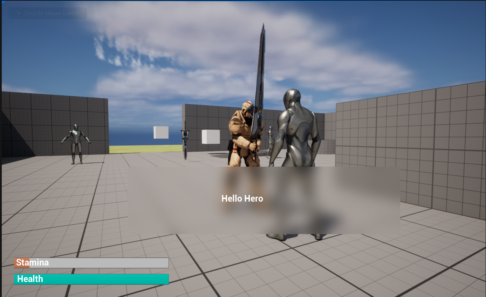

<h2 id="introduction">About:</h2>
This was my first Unreal Engine 5 project to learn and understand the software. I had previously used Unreal Engine 4 before a couple years go but there was a steep learning curve to understand how to use it. After creating this game I had a way better understanding of how to use it. The game is a rougelike where you enter a castle and after each enemy you kill they have a chance to drop an item after they die. After 4 floors, you fight a boss the enter the next part of the castle.

<h2 id="introduction">Direction of the game:</h2>
This projects goal was to be able to be able to make a game in Unreal Engine 5. There are a couple of inspirations that can be notice if you play the game. The dialogue system is based off of Animal Crossing's dialogue where each letter makes a different vocal sound. Another fun fact is when the player makes a successful parry or block you can hear a big metal clang that is from the anime Berserk.

<h2 id="introduction">What I learned:</h2>
I learned a lot of things from this project, understanding Unreal Engine 5's Blueprint Editor, how to write code for video game combat, and lastly how create a dialogue system for a video game. All of these experiences will help me later down the line creating better and more ploished video game experiences. 

<h2 id="introduction">Screenshots:</h2>
<pre>
<h3 id="introduction">Dialogue System</h3>

<h3 id="introduction">Working combat system with the player being able to attack, parry, and block</h3>

</pre>

