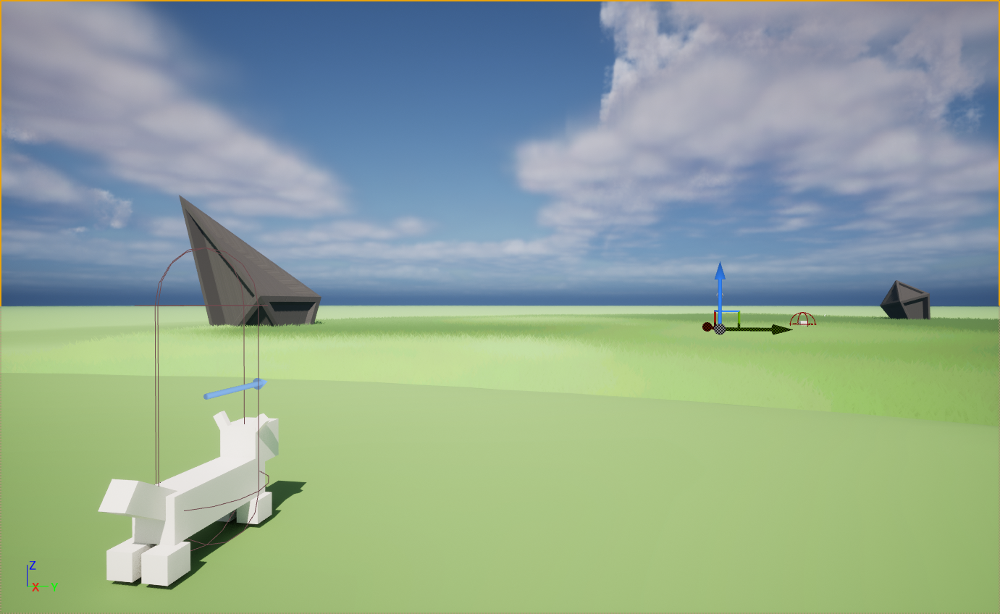

<h2 id="introduction">About:</h2>
This action adventure game you play cat that is retrieving materials for her owner who is a witch. You play as a the cat with magical abilities, and as you progress through the game you can aquire more abilities to venture farther into each level.

<h2 id="introduction">Development of the game:</h2>
So far the game's player movement and other systems are finished. Currently the game is being worked on by two people, me and my partner. My partner Ali is working on creating 3D assets and art for the game. Later in development she hopes to storyboard important story-beats of the game so there is a narrative. As far as my work goes, I'm lead programmer, animator, and composer for the game. For all of my games, I haven't had enough experience writing or composing music for games but I've always wanted to do so. The development of the game so far is going well, there is no deadline currently and we are working when we can to make this an amazing experience.

<h2 id="introduction">Direction of the game:</h2>
The games art will be heavily inspired by games like The Legend of Zelda: Breath of the Wild, and Tears of the Kingdom as well as works from Studio Ghibli like Howl's Moving Moving Castle and Princess Mononoke. We hope to finish this project and make it a great game!

<h2 id="introduction">Screenshots:</h2>
<h3 id="introduction">Some ruins from an ancient civilization....</h3>

<h3 id="introduction">Another angle looking at the player prototype model.</h3>

