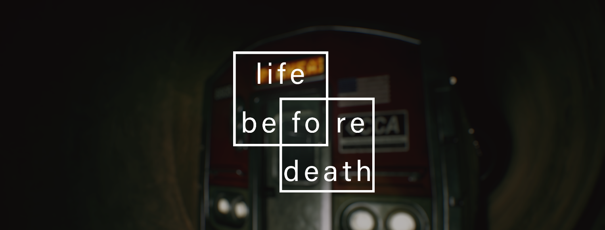
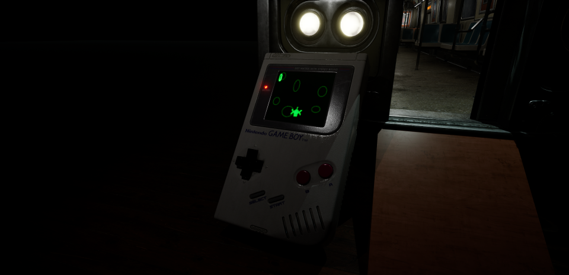
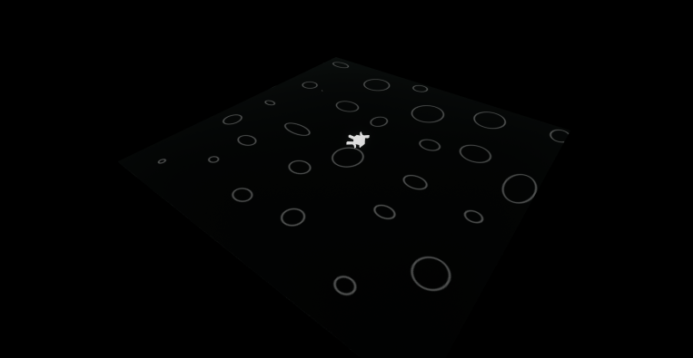
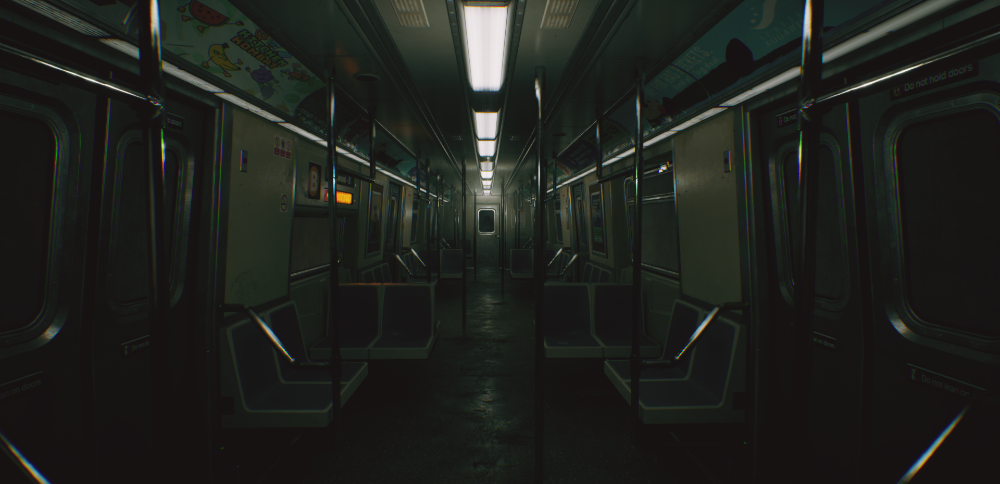
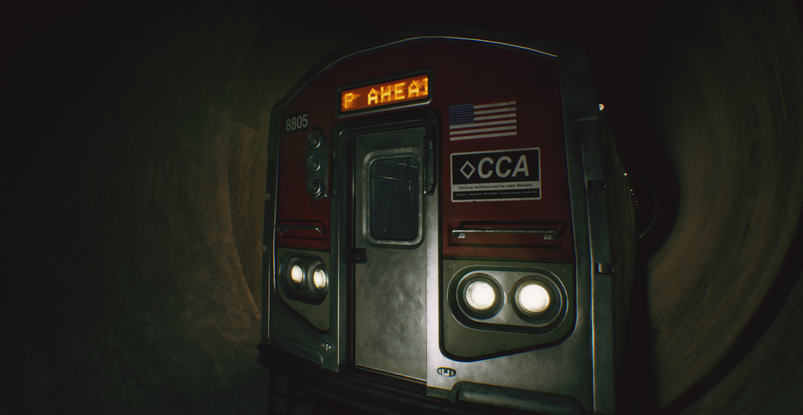
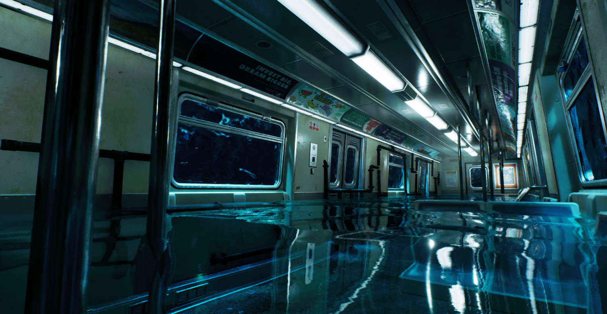
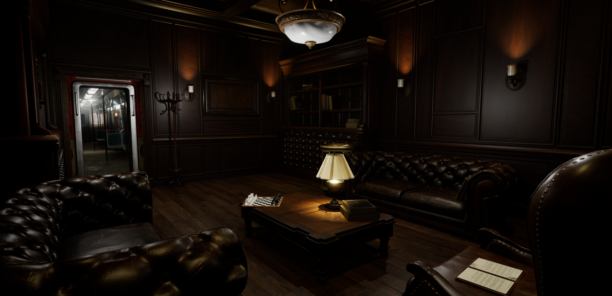
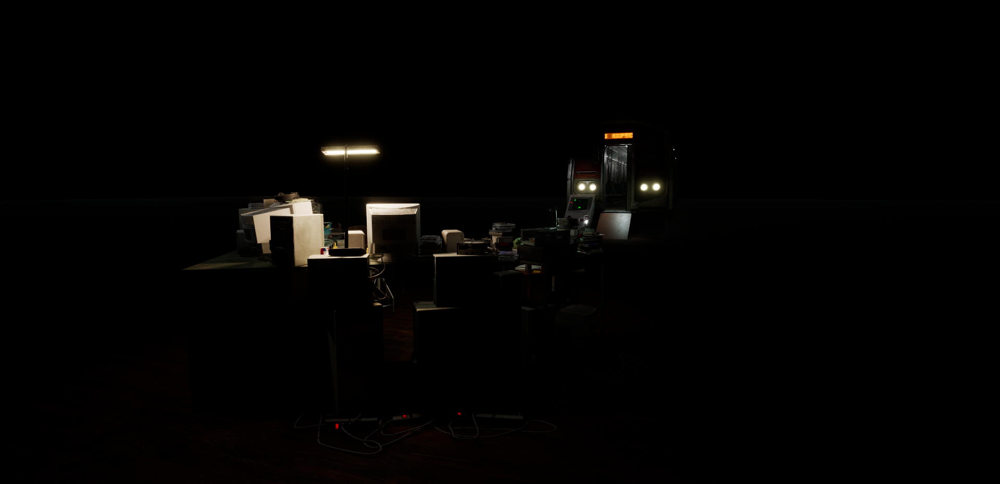
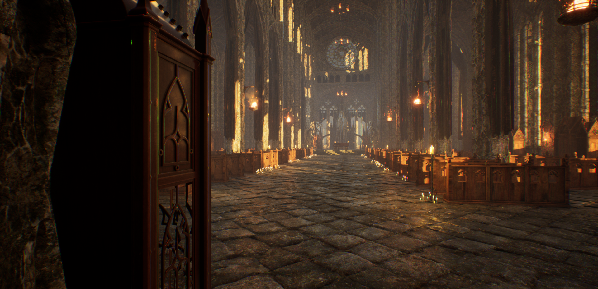

<h2 id="introduction">What is Life Before Death:</h2>
Life Before Death is a first person puzzle mystery game where you play as John who abords a subway train heading somewhere, but he can't seem to remember. All he remembers is that he was on the train with his daughter Vivian, going somewhere. When playing as John you can interact with different objects in the environment and solve puzzles to find the answers you're looking for.
 

<iframe src="https://store.steampowered.com/widget/3282650/" frameborder="0" width="646" height="190"></iframe>

 

<h2 id="introduction">Development of Life Before Death:</h2>
Life Before Death is a Video Game Development project that was created for ICS-485 at the University of Hawai'i at Manoa (Video Game Design and Development Class) for Spring 2024. Development of Life Before Death started February 18, 2024 and is still currently in development. The current development team consists of Liam (Kula) Van Asperen, Kevin Clarkin, and Benjamin Crawford. For our final assignment for the class project our team had to make a fully playable video game by the end of the semester with a team consisting of students from the class. Before Life Before Death became a first person puzzle mystery game, there were many different ideas from the team on what the group game development project should be. There were ideas from a cyborg ninja running on clouds to stop a mega corporation from taking over the world to a game where you journey down into the depths of an ancient alien castle buried beneath the earth. Although each of the team members liked all of the ideas presented to each other, the idea to go for something more manageable in scale made more sense due to the 2 month deadline. Ben Crawford suggested the horror game route to the team with a scary subway train game demo he had made with Unreal Engine 5 and since the consensus was to use Unreal Engine 5 as the game engine of choice for the team, it made sense to go this route.  
 

<h2 id="introduction">My Contributions to Life Before Death:</h2>
For Life Before Death, I worked on many different things like programming the game, creating cutscenes, creating puzzles, organizing the team, setting up and maintaining the source control and source control server for the project, writing the story and characters, getting the voices for the characters, finding free assets for the game, and creating levels for the player to explore. Working on the game required a lot of effort but I believe it paid off. Below I will show one of the puzzles I worked on:
 

 
Here is a GameBoy that is leaning on the subway train in one of the levels, the solve this puzzle the player needs to acquire batteries from a different area and use them on the GameBoy. Once the player does that, they can play a little asteroid game on the game boy.
 

 
The way that this was done was by making an Unreal Engine Blueprint that the player could possess and play once they interacted with the Gameboy. The actual asteroid game takes place far below the map of where the subway train in the same level (an image of what it looks like without the filter is shown below). There is a camera attached to the asteroid spaceship that displays the viewport of the camera with a GameBoy material filter I made to give the vibe of using the original handheld.

<h2>Screenshots:</h2>

