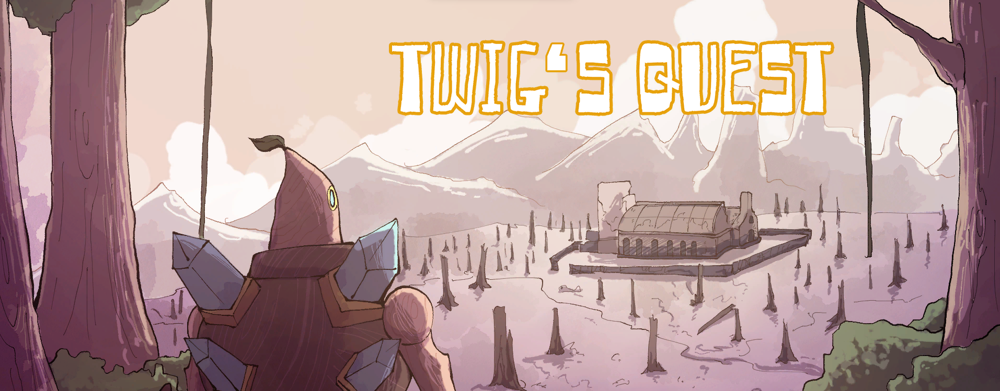

<h2 id="introduction">What is Twig?:</h2>
In this third-person FPS action game, you explore a small island as Twig trying to figure out were a large source of polution is harming the life of his home.

<h2 id="introduction">Development of Twig:</h2>
Twig's Quest or Twig is a small indie game developed for MULT 3651 (Game Design) as part of a final project at HPU (Hawai'i Pacific University). The game was built in Unity for about a month and finished in May 2022. I developed this game with three other people, with my role being the programmer, choosing music, and cutscene direction. It was a lot of fun, and this project took a lot of work. For MULT 3651 before we worked on Twig, each student worked on three of their own projects throughout the class. This experience was extremely helpful when collaborating on Twig so we could make the game we wanted.  

Here is a link to a video trailer of the game: [Twig Trailer](https://www.youtube.com/watch?v=sulj7yxplEQ)

<iframe frameborder="0" src="https://itch.io/embed/2243981" width="552" height="167"><a href="https://skelefrog.itch.io/twigs-quest">Twig's Quest by skelefrog</a></iframe>

<h2 id="introduction">Screenshots:</h2>

