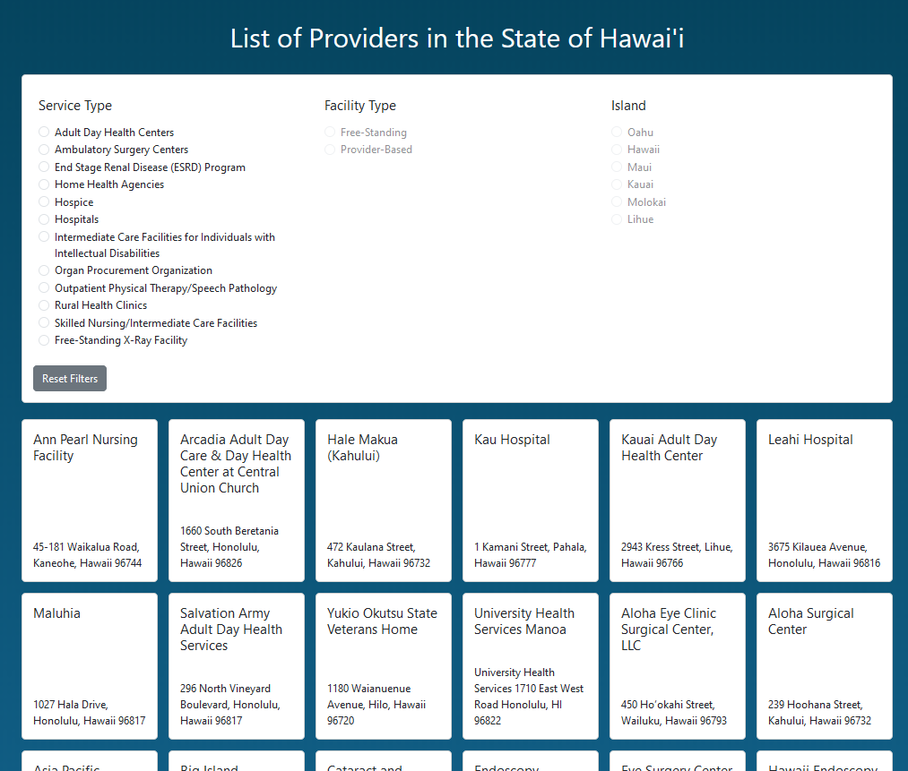
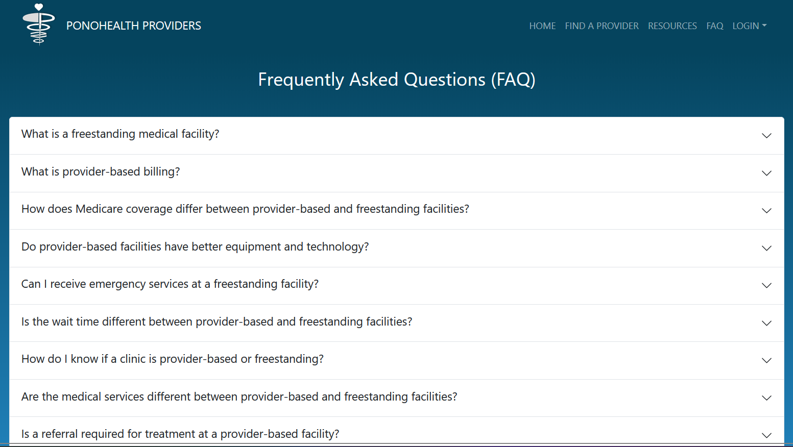

<h1>The Project</h1>
PonoHealthProviders was originally created for the 2023 [Hawai'i Annual Code Challenge HACC](https://hacc.hawaii.gov/), the idea was to create a web app for individuals to find resources for Uninsured/Underinsured people. The app would save users time by aggregating all the information they would need into one place when looking for healthcare. Users may save money when finding less costly solutions. Time may further be saved when a user finds a closer place for a particular service. I personally had a lot of issues when it came to finding healthcare providers in the state of Hawai'i. Having that experience really helped me understand what I wanted to add to an application like this. 

  
  

<h1>What I contributed</h1>
At the start of our registration for the project, we needed a team leader to participate so I took the position. I made sure we were kept on track, met deadlines, setting up meetings, and so on. I helped choose the visual color paluatte, created the filter feature with help from some teammates, and added a way to upload profile photos for the users. 

  
  

<h1>What I learned</h1>
I learned a lot from this project esspically about project management. I found issue driven project management guidelines very effective for not only my team but myself as well. I feel that having these guidelines in my earlier stages of my project management habits will be greatly beneficial in the long run. I can definitely tell now that I was developing some bad habits that could have hurt my productivity that I normally wouldn’t have seen.

You can learn more on the [PonoHealthProviders Website](https://ponohealthproviders.com/home).
