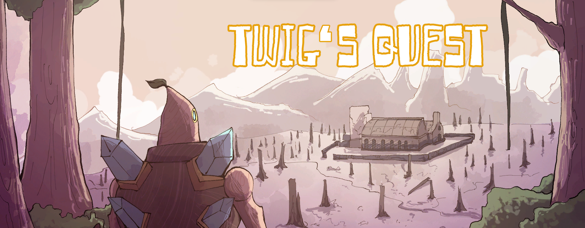
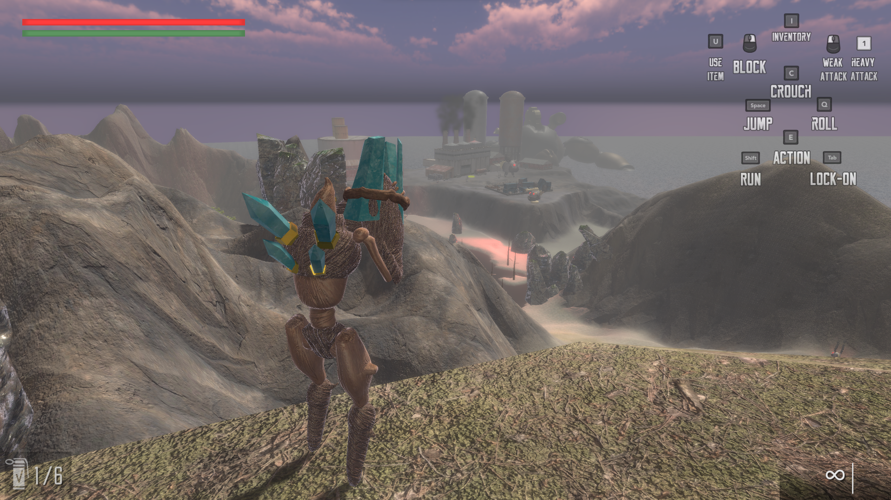

Cotton is a horror-style text-based adventure game I developed using the functions and macros built from The Wizard's Game in [Conrad Barski's Land of Lisp](http://landoflisp.com/). Slightly more interesting and convoluted! (It is not that scary.)

In this third-person FPS action game, you explore a small island as Twig trying to figure out were a large source of polution is harming the life of his home

Here is a link to a video trailer of the game: [Twig Trailer](https://www.youtube.com/watch?v=sulj7yxplEQ)

Here are screen-shots from the game:

